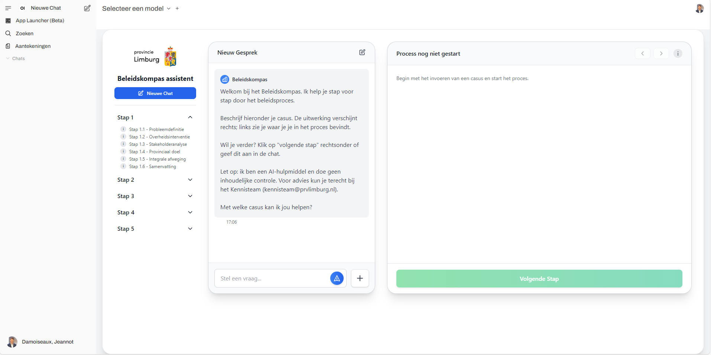

# Beleidskompas Assistent

De **Beleidskompas Assistent** ondersteunt medewerkers bij het gestructureerd doorlopen van het beleidsproces binnen overheidsorganisaties, zoals Provincie Limburg. De applicatie biedt een stapsgewijze workflow, van probleemdefinitie tot besluitvorming en implementatie, inclusief AI-ondersteuning per stap.

**Dit project wordt ontwikkeld in samenwerking met CGI Smartlab.**

## Features
- Stapsgewijze navigatie door het beleidsproces
- Invoer en begeleiding per processtap
- AI-gestuurde suggesties en checkvragen
- Opslaan en exporteren van resultaten (Word/PDF)
- Mogelijkheid om provinciale termen en kaders in te stellen

## Werkwijze
1. **Start een nieuwe casus**  
   Voer de casusinformatie in en doorloop de beleidsstappen.
2. **Doorloop het proces**  
   Vul per stap de benodigde informatie in en ontvang AI-suggesties.
3. **Bekijk voortgang en samenvatting**  
   Het systeem toont per stap een overzicht van ingevulde antwoorden.
4. **Exporteer je resultaat**  
   Download een compleet beleidsdocument aan het einde van het proces.

## Screenshots

## AI Workflow visualisatie

